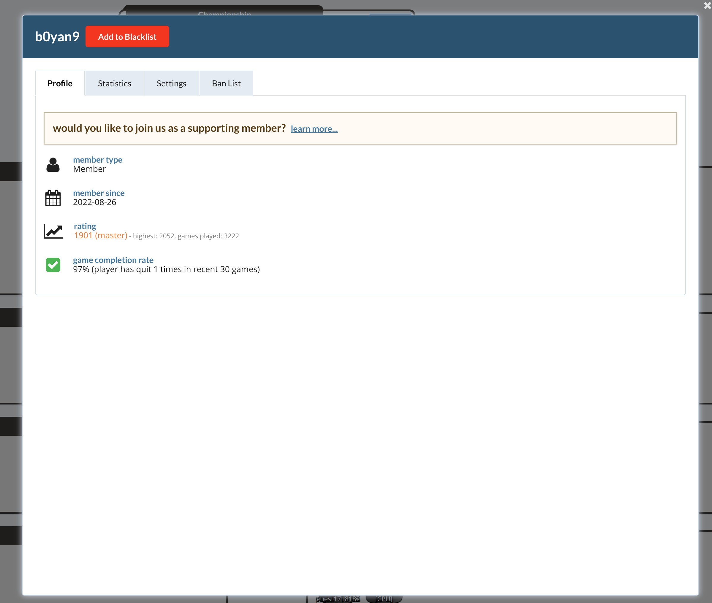
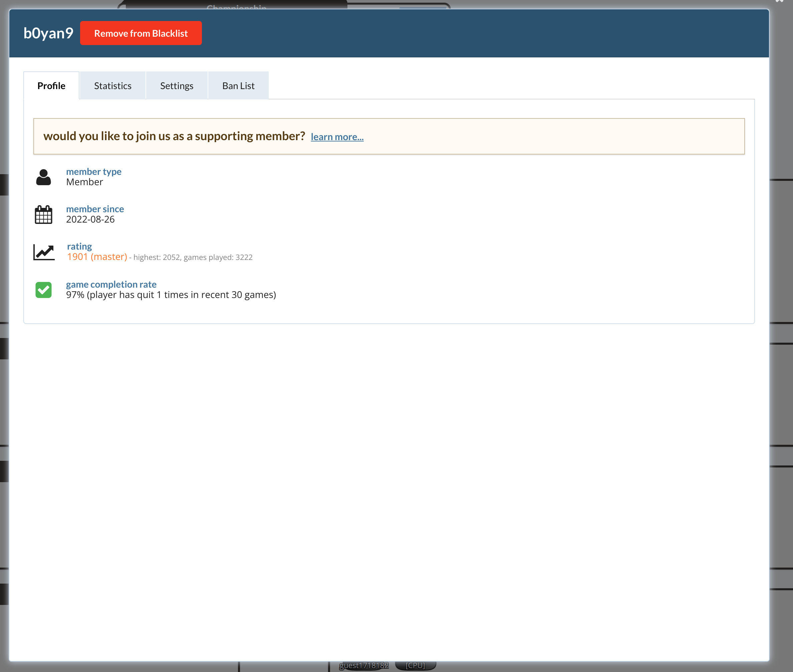
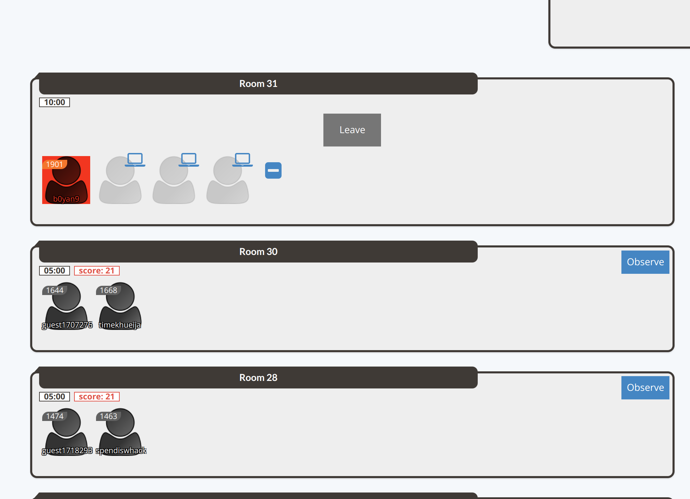

# Spendee Blacklist

This is a chrome extension for the online game [spendee (a splendor alternative)](https://spendee.mattle.online/lobby/rooms). 
I like it very much. However, there are some bad users who bring unpleasant experience. 

This extension will maintain a blacklist in the local storage. You may add/remove users from this list. It will label the users who are in your blacklist. 

# How to install

I do not want to pay to register for the web store developer, so it is not published in the chrome web extension store. 
You will need to download and install it manually. 

## Steps:
1. Download this project,
2. Go to the Extensions page by entering chrome://extensions in a new tab. (By design chrome:// URLs are not linkable.)  
    a. Alternatively, click the Extensions menu puzzle button and select Manage Extensions at the bottom of the menu.  
    b. Or, click the Chrome menu, hover over More Tools, then select Extensions.  
3. Enable Developer Mode by clicking the toggle switch next to Developer mode.
4. Click the Load unpacked button and select the extension directory.

## How it works
1. Button to add/remove user to/from the blacklist;

2. Users in the blacklist are marked to red; 

# Plans
1. Public blacklist. Maintain a public blacklist so that people can know bad users without playing with them. This list should be verified. People need to provide the game link as evidence for verification. 
2. Blacklist importing. With this, you can import a list of bad users directly, instead of adding them when you meet them. 
3. Remote dataset. Local storage is unreliable because they may get lost when you clear browser data or doing some other actions. A remote database is more reliable.

# Notes
1. This extension only interacts with spendee. 
2. Data is stored locally and code is open-sourced. You do not need to worry about your privacy and security. 
3. Data is stored locally, so they may get lost after you clear broswer cache or update the browser, or for other unknown reasons. 

# Acknowledgement
The [icon](https://www.flaticon.com/free-icon/businessman_208975?term=blacklist&page=1&position=4&origin=search&related_id=208975) is created by Gregor Cresnar. It is under Flaticon License. 
